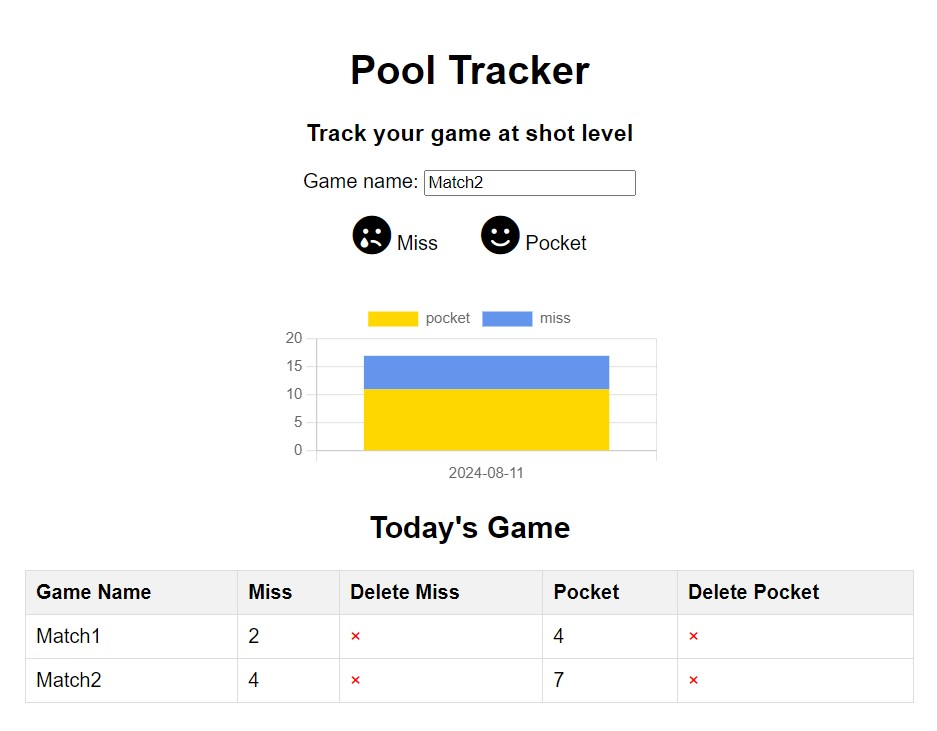

# Pool Shot Tracker
This fun project helps anyone who want to practice pool by tracking every shots whether they are miss or pocket ball.

## How to Use
To use this tracker, you can directly visit https://pools.aryya.id or simply host on your own server by pull and push necessary files (index.html, script.js, and style.css).

## Supported feature
1. Count everyshot, pocket or miss
2. Distinguish shots based on day and game level
3. Increase/decrease shots just in case you misclick
4. Visualize total shots by a day

## Nice to have (for the future)
Sync for multiple devices.